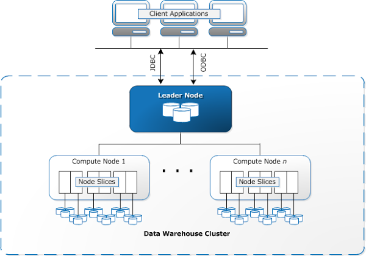

## Redshift Architecture

- Redshift architecture is based on a **massively parallel processing (MPP)** system that distributes query processing across multiple nodes. 
- The architecture is designed to **scale horizontally**, meaning you can add more compute or storage resources as data grows to meet performance demands.

---

### 1. **Clusters**

- A **Redshift cluster** is the primary unit of compute resources and storage. 
- When you launch a Redshift data warehouse, you're creating a cluster. 
- Each cluster consists of one or more nodes working together to store and process data.

#### **Leader Node**:
- The leader node is responsible for managing the query execution process, coordinating queries, and aggregating results from the compute nodes.
- It **doesn't store data** but controls the overall operation of the cluster.

#### **Compute Nodes**:
- These nodes are the workhorses of the Redshift cluster. 
- They store the actual data and process queries sent by the leader node.
- **Compute nodes** handle the heavy lifting of both storing large datasets and performing computations during query execution.

A Redshift cluster can have multiple compute nodes. The number of nodes you choose depends on your performance and storage requirements.

---

### 2. **Node Types**

Redshift provides several node types to cater to different use cases:

- **Dense Storage (DS) Nodes**:
  - Designed for workloads with **large data storage needs** and relatively lower performance requirements.
  - Use **HDD (hard disk drives)** for storage.

- **Dense Compute (DC) Nodes**:
  - Optimized for **high-performance**, low-latency workloads.
  - Use **SSD (solid-state drives)** for faster data access.

- **RA3 Nodes**:
  - These nodes **separate compute and storage**, offering more flexibility.
  - You can scale **compute resources independently of storage**, making them ideal for dynamic workloads where compute and storage needs grow at different rates.
  - RA3 nodes use **managed storage in Amazon S3**.

The choice of node type directly impacts the **cluster's cost**, **performance**, and **scalability**.

---

### Summary

- Redshift clusters are composed of **Leader Nodes** and **Compute Nodes**.
- **Leader Nodes** manage query execution, while **Compute Nodes** store and process data.
- **Node Types** (Dense Storage, Dense Compute, and RA3) are selected based on performance, storage needs, and scalability requirements.
